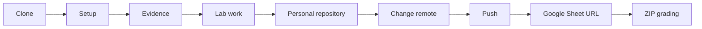

# Course workflow

This is the single workflow for every lab. Do it in this order so your grader can reproduce your work.

1. **Clone** the stated public lab repository. Do not edit the source repository on GitHub.
2. **Set up** tools and run the baseline command before changing code.
3. **Collect evidence** as you go: commands, reports, screenshots, and known issues.
4. **Complete the lab** and tick its checklist.
5. **Create a new empty personal GitHub repository** named clearly, for example `FIT4110_Lab03_StudentID`.
6. **Change `origin`**, push `main`, then verify the files in the web interface.
7. **Submit the repository URL** in the course Google Sheet before the deadline. The instructor grades the downloaded ZIP of that repository.

Never submit a local folder, another team’s URL, an expired temporary link, or a repository that requires the grader to request access.
