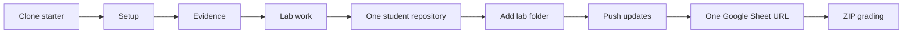

# Course workflow

This is the single workflow for every lab. Do it in this order so your grader can reproduce your work.

1. **Clone** the stated public lab repository. Do not edit the source repository on GitHub.
2. **Set up** tools and run the baseline command before changing code.
3. **Collect evidence** as you go: commands, reports, screenshots, and known issues.
4. **Complete the lab** and tick its checklist.
5. **Create one empty public personal GitHub repository** once for the whole semester, named `FIT4110_<MãSinhViên>` (for example, `FIT4110_11223344`).
6. **Add each completed lab to its own folder** inside that repository: `01_Setup/`, `02_OpenAPI/`, `03_Postman/`, `04_Docker/`, `05_Compose/`, and `06_Plugathon/`. Do not place a Git repository inside another Git repository; copy the completed starter contents but exclude the starter's `.git` folder.
7. **Commit and push after every lab**. The same repository URL remains your submission URL throughout the semester.
8. **Submit that one repository URL** in the course Google Sheet when instructed. The instructor grades the downloaded ZIP of the repository.

Never submit a local folder, another team’s URL, an expired temporary link, or a repository that requires the grader to request access.

---

## Bản dịch tiếng Việt

Đây là quy trình chung cho mọi Lab để giảng viên có thể chạy lại bài. Clone starter công khai, cài môi trường, tạo minh chứng, hoàn thành Lab, rồi thêm nội dung vào **một** repository public duy nhất tên `FIT4110_<MãSinhViên>`. Mỗi Lab nằm trong thư mục riêng; không sao chép thư mục `.git` của starter vào portfolio. Commit/push sau từng Lab và chỉ nộp một URL repository trong Google Sheet. Không nộp thư mục local, URL của người khác hoặc repository cần cấp quyền.
