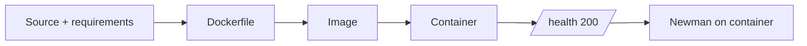

# Lab 04 — Docker packaging

Use [FIT4110_lab04_docker_packaging](https://github.com/TrangLe1912/FIT4110_lab04_docker_packaging). A container is valuable when the service starts the same way on another machine, not merely when `docker build` succeeds.

Deliverables: Dockerfile, `.dockerignore`, `.env.example`, run guide, contract, Postman collection/environment, report, and build/run/health evidence. Build with a meaningful tag, run as a non-root user where feasible, and retest the container with Lab 03’s collection.

Read [Docker Guide](../03_Guides/Docker_Guide.md) before cleanup. Never run broad pruning commands on a shared machine unless you understand what they remove.
