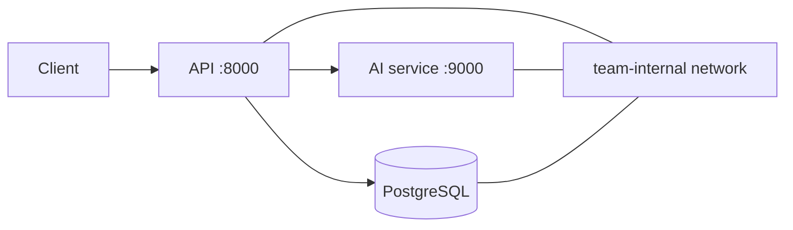

# Lab 05 — Docker Compose

Use [FIT4110_lab05_docker_compose](https://github.com/TrangLe1912/FIT4110_lab05_docker_compose). Compose expresses the runnable architecture: services, networks, configuration, startup checks, and persistent data.

Copy `.env.example` to a local `.env`; do not commit it. Run `docker compose up -d --build`, inspect `docker compose ps` and logs, exercise API and AI health endpoints, and run the Compose test target if supplied.

> Source compatibility note: the current starter declares an external `class-net`, so create it first if it is not provided (`docker network create class-net`). Its published Compose test script is a TODO placeholder; copy/adapt your Lab 04 collection and document the actual Newman command/report. The API healthcheck may also need a Python-based check if the image does not include `curl`.

---
## Bản dịch tiếng Việt

Compose mô tả kiến trúc chạy được: service, network, cấu hình, healthcheck và dữ liệu bền vững. Sao chép `.env.example` thành `.env` nhưng không commit file này; chạy `docker compose up -d --build`, kiểm tra `ps`/logs, health API/AI và readiness database. Starter hiện yêu cầu external `class-net`; tạo network nếu máy chưa có. Script test Compose hiện là placeholder, cần ghi rõ lệnh Newman thực tế và report.

Deliverables: compose file, `.env.example`, run guide, evidence of each health check, architecture explanation, image tags, test report, and readiness checklist.
