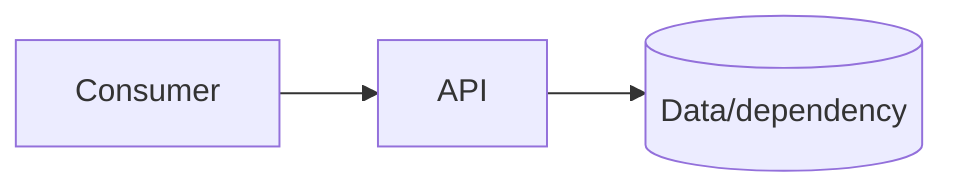

# `<service-name>`

## Purpose

What user/problem does this service solve? What is deliberately outside scope?

## Architecture



## Run from a clean clone

```bash
cp .env.example .env
docker compose up -d --build
curl http://localhost:8000/health
```

## Contract and testing

- Contract: `openapi.yaml`
- Test command:
- Expected report:
- Known limitations: `known-issues.md`

## Evidence

List the evidence directory and the exact release/commit used for demonstration.

## Bản dịch tiếng Việt

Mô tả service giải quyết bài toán gì, phạm vi và kiến trúc. Ghi lệnh chạy từ clone sạch, contract, lệnh test, report, known issues và commit dùng để demo.
