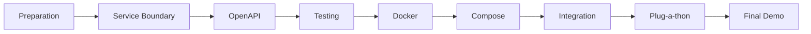
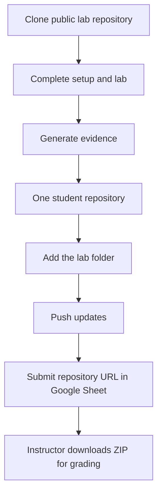

# FIT4110 — Student Kit

Official, semester-long guide for **FIT4110 – Dịch vụ kết nối & Công nghệ nền tảng**. This kit is the course map, not a replacement for the lab repositories. For technical tasks, artefacts, and lab-specific grading criteria, the linked TrangLe1912 repository is authoritative; this Kit intentionally changes only the submission workflow.

## Why this matters for CS / AI students

An accurate model, notebook, or data pipeline is not yet a product. A production team needs a clear boundary, a stable API contract, tests, a portable runtime, and a way to run dependent services together. FIT4110 teaches the engineering bridge from AI/data/software work to an operable service.

## Quick start

1. Read [Session 0](01_Getting_Started/SESSION0_Preparation.md) and complete the setup checks.
2. Follow [the course workflow](01_Getting_Started/COURSE_WORKFLOW.md) before beginning any lab.
3. Open the matching lab guide below; clone its public starter repository.
4. Create one portfolio repository named `FIT4110_<MãSinhViên>`, keep every lab in its own folder, and submit that one URL through the course Google Sheet.

## Lab ecosystem

| Stage | Use this public source repository | Student outcome |
|---|---|---|
| Lab 01 | [FIT4110_setup](https://github.com/TrangLe1912/FIT4110_setup) | environment evidence + service boundary |
| Lab 02 | [FIT4110_lab02_openapi](https://github.com/TrangLe1912/FIT4110_lab02_openapi) | OpenAPI contract + negotiation record |
| Lab 03 | [FIT4110_lab03_postman_mock_testing](https://github.com/TrangLe1912/FIT4110_lab03_postman_mock_testing) | Postman tests, mock, Newman report |
| Lab 04 | [FIT4110_lab04_docker_packaging](https://github.com/TrangLe1912/FIT4110_lab04_docker_packaging) | Dockerfile, runnable image, evidence |
| Lab 05 | [FIT4110_lab05_docker_compose](https://github.com/TrangLe1912/FIT4110_lab05_docker_compose) | reproducible multi-service stack |
| Lab 06 | No separate public starter currently listed | integration handshake + Plug-a-thon evidence |

The instructor-only setup repository is intentionally not required by students.

## Submission in one view

Read [Git Guide](03_Guides/Git_Guide.md) and [Submission](03_Guides/Submission.md) for exact commands.

## Navigation

- [Getting started](01_Getting_Started/LEARNING_MAP.md)
- [Lab guides](02_Labs/)
- [Guides and troubleshooting](03_Guides/)
- [Student templates](04_Templates/)
- [Assessment and demo pack](05_Assessment/)
- [FAQ](03_Guides/FAQ.md)

## Course principle

**Contract is the shared promise; artefacts are the evidence.** Make every submission reproducible from a clean clone.

---

# Bản dịch tiếng Việt

## Tổng quan học phần

Đây là bộ hướng dẫn chính thức cho **FIT4110 – Dịch vụ kết nối & Công nghệ nền tảng**. Student Kit là bản đồ học phần; các repository Lab công khai của TrangLe1912 là nguồn chính thức cho nhiệm vụ kỹ thuật, artefact và tiêu chí riêng của từng bài. Kit này chỉ chủ động thay đổi quy trình nộp bài. Mục tiêu là tạo ra bài làm có thể chạy lại, tích hợp và chấm từ một bản ZIP.

## Vì sao sinh viên Khoa học máy tính / AI cần học nội dung này?

Một mô hình chính xác, notebook hoặc pipeline dữ liệu chưa phải là sản phẩm. Để vận hành trong thực tế, nhóm cần ranh giới trách nhiệm rõ ràng, API ổn định, kiểm thử, môi trường chạy di động và cách khởi động các dịch vụ phụ thuộc. FIT4110 là cầu nối từ AI/dữ liệu/phần mềm sang dịch vụ có thể triển khai.

## Bắt đầu nhanh

1. Đọc Session 0 và hoàn thành kiểm tra môi trường.
2. Làm theo quy trình học phần trước khi bắt đầu Lab.
3. Clone repository starter công khai của Lab tương ứng.
4. Tạo **một** repository public duy nhất tên `FIT4110_<MãSinhViên>`; lưu từng Lab trong thư mục riêng và nộp cùng một URL qua Google Sheet.

## Hệ sinh thái Lab

Lab 01 kiểm tra môi trường và ranh giới service; Lab 02 xây contract REST OpenAPI hoặc event contract sơ bộ tùy loại cặp; Lab 03 kiểm thử bằng Postman/mock/Newman; Lab 04 đóng gói Docker; Lab 05 chạy nhiều service bằng Compose; Lab 06 tích hợp Plug-a-thon theo thông báo của giảng viên. Repository dành cho giảng viên không thuộc phạm vi sinh viên.

## Quy trình nộp bài

Clone starter → hoàn thành môi trường và Lab → tạo minh chứng → thêm vào thư mục Lab trong repository `FIT4110_<MãSinhViên>` → push → nộp **một URL** Google Sheet → giảng viên tải ZIP để chấm.

## Nguyên tắc học phần

**Contract là cam kết chung; artefact là minh chứng.** Mọi bài làm phải chạy lại được từ một bản clone sạch.
