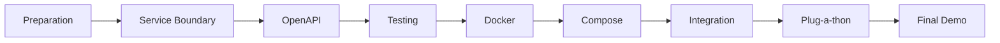
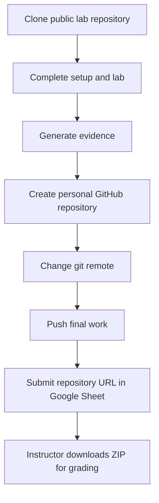

# FIT4110 — Student Kit

Official, semester-long guide for **FIT4110 – Dịch vụ kết nối & Công nghệ nền tảng**. This kit is the course map, not a replacement for the lab repositories: use it to understand *why* each lab exists, start correctly, and submit a reproducible repository.

## Why this matters for CS / AI students

An accurate model, notebook, or data pipeline is not yet a product. A production team needs a clear boundary, a stable API contract, tests, a portable runtime, and a way to run dependent services together. FIT4110 teaches the engineering bridge from AI/data/software work to an operable service.

## Quick start

1. Read [Session 0](01_Getting_Started/SESSION0_Preparation.md) and complete the setup checks.
2. Follow [the course workflow](01_Getting_Started/COURSE_WORKFLOW.md) before beginning any lab.
3. Open the matching lab guide below; clone its public starter repository.
4. Keep evidence as you work. When ready, move the remote to your own repository and submit its URL through the course Google Sheet.

## Lab ecosystem

| Stage | Use this public source repository | Student outcome |
|---|---|---|
| Lab 01 | [FIT4110_setup](https://github.com/TrangLe1912/FIT4110_setup) | environment evidence + service boundary |
| Lab 02 | [FIT4110_lab02_openapi](https://github.com/TrangLe1912/FIT4110_lab02_openapi) | OpenAPI contract + negotiation record |
| Lab 03 | [FIT4110_lab03_postman_mock_testing](https://github.com/TrangLe1912/FIT4110_lab03_postman_mock_testing) | Postman tests, mock, Newman report |
| Lab 04 | [FIT4110_lab04_docker_packaging](https://github.com/TrangLe1912/FIT4110_lab04_docker_packaging) | Dockerfile, runnable image, evidence |
| Lab 05 | [FIT4110_lab05_docker_compose](https://github.com/TrangLe1912/FIT4110_lab05_docker_compose) | reproducible multi-service stack |

The instructor-only setup repository is intentionally not required by students.

## Submission in one view

Read [Git Guide](03_Guides/Git_Guide.md) and [Submission](03_Guides/Submission.md) for exact commands.

## Navigation

- [Getting started](01_Getting_Started/LEARNING_MAP.md)
- [Lab guides](02_Labs/)
- [Guides and troubleshooting](03_Guides/)
- [Student templates](04_Templates/)
- [Assessment and demo pack](05_Assessment/)
- [FAQ](03_Guides/FAQ.md)

## Course principle

**Contract is the shared promise; artefacts are the evidence.** Make every submission reproducible from a clean clone.
